# EvidenceGraph Ranker — Architecture Deep Dive

## 1. Architecture overview

EvidenceGraph Ranker is organized as:

1. Python ranking engine in `src/redrob_ranker`.
2. FastAPI backend in `api`.
3. Next.js + TypeScript + Tailwind frontend in `frontend`.
4. CLI tools at repo root: `rank.py`, `validate.py`, `battlecards.py`, `compare.py`, `evaluate.py`.
5. Outputs under `outputs/`: CSV, JSON, evidence ledgers, reports, battle cards, comparison, runtime/performance.
6. Tests under `tests/` and docs under `docs/`.

## 2. Mermaid system architecture diagram

```mermaid
flowchart LR
  JD["JD input"] --> JDParser["job_understanding.parse_job_description"]
  JDParser --> Matrix["RoleRequirementMatrix"]
  File["Candidate file input"] --> Adapter["schema.load_candidate_records"]
  Adapter --> Record["CandidateRecord"]
  Record --> Dict["to_scoring_dict"]
  Dict --> Features["features.extract_features"]
  Matrix --> Scoring["scoring.score_candidates"]
  Features --> Scoring
  Scoring --> Components["ScoreComponents + ProductScores"]
  Components --> Ledger["evidence_ledger.build_evidence_ledger"]
  Components --> Risk["risk.build_risk_radar"]
  Components --> Reason["reasoning.generate_structured_reasoning"]
  Ledger --> Output["io.build_product_ranking_output"]
  Risk --> Output
  Reason --> Output
  Output --> CLI["CLI exports"]
  Output --> API["FastAPI"]
  API --> UI["Recruiter Intelligence Console"]
  Output --> Exports["CSV / JSON / battlecards / reports"]
```



## 3. Backend architecture

`api/main.py` creates `FastAPI(title="EvidenceGraph Ranker API")`, CORS for local frontend, health/demo routes, and includes routers. Route files are thin wrappers. `api/services/ranker_service.py` owns ranking, upload parsing, latest in-memory payload, comparison, evaluation, CSV export, and trust audit.

| Method | Path | Purpose | Input | Output | Code file | Test status |
|---|---|---|---|---|---|---|
| GET | `/api/health` | Health check | None | status/service JSON | `api/main.py` | Tested in `test_api_backend.py` |
| GET | `/api/demo-data` | Demo JD/candidates | None | demo data JSON | `api/main.py` | Route exists; not deeply tested |
| POST | `/api/rank` | Rank JSON candidates or demo fallback | `RankRequest` | product ranking payload | `api/routes/ranking.py` | Tested |
| GET | `/api/rank/latest` | Latest in-memory ranking | None | product ranking payload | `api/routes/ranking.py` | Tested |
| POST | `/api/rank/upload` | Multipart ranking | candidate file, job text/file, top_n | product ranking payload | `api/routes/ranking.py` | Tested |
| GET | `/api/candidates` | List latest candidates | None | `{candidates:[...]}` | `api/routes/candidates.py` | Indirectly covered |
| GET | `/api/candidates/{candidate_id}` | Candidate detail | path id | row or 404 | `api/routes/candidates.py` | Route exists |
| POST | `/api/compare` | Compare two candidates | `CompareRequest` | comparison payload | `api/routes/compare.py` | Tested |
| POST | `/api/evaluate` | Evaluate ranking | `EvaluateRequest` | metrics/report payload | `api/routes/evaluation.py` | Route exists |
| GET | `/api/exports/ranked-json` | Export latest JSON | None | latest payload | `api/routes/exports.py` | Route exists |
| GET | `/api/exports/ranked-csv` | Export latest CSV | None | text/csv | `api/routes/exports.py` | Route exists |
| GET | `/api/trust-audit` | Latest trust summary | None | trust audit JSON | `api/routes/trust_audit.py` | Tested |

## 4. Core ranking engine architecture

| Module | Purpose | Important classes/functions | Inputs | Outputs | Connections |
|---|---|---|---|---|---|
| `models.py` | Dataclasses for features/scores/ranking | `CandidateFeatures`, `ScoreComponents`, `ProductScores`, `ScoredCandidate`, `RankedCandidate` | extracted values | typed score objects | used by scoring/io/reasoning |
| `config.py` | Scoring weights | `ScoringWeights`, `DEFAULT_WEIGHTS` | none | weights | used by `scoring.py` |
| `schema.py` | Flexible ingestion adapter | `CandidateRecord`, `load_candidate_records`, `adapt_candidate_record` | file/raw records | records/scoring dicts | used by CLI/API |
| `io.py` | Legacy/product writers | `iter_candidates`, `build_product_ranking_output`, writers | scored/ranked rows | CSV/JSON payload/files | calls ledger/risk/reasoning/review tags |
| `job_understanding.py` | Deterministic JD parser | `RoleRequirementMatrix`, `parse_job_description`, `default_role_requirements` | JD text | role matrix | used by CLI/API/scoring |
| `features.py` | Evidence/signal extraction | `extract_features` | candidate dict | `CandidateFeatures` | core scoring input |
| `scoring.py` | Candidate scoring/ranking | `score_candidate`, `score_components`, `apply_role_requirements_adjustments`, `normalize_product_scores`, `rank_scored_candidates` | candidate + role matrix | scored/ranked objects | calls features/fairness/reasoning |
| `evidence_ledger.py` | Audit trail | `build_evidence_ledger` | `ScoredCandidate` | ledger dict | used by product output |
| `risk.py` | Structured risks | `build_risk_radar` | scored candidate + role matrix | risk dicts | used by UI/output |
| `fairness.py` | Role-relevant guard | `strip_protected_attributes`, `fairness_metadata` | candidate dict | cleaned candidate/metadata | used in scoring/io |
| `reasoning.py` | Grounded explanations | `generate_reasoning`, `generate_structured_reasoning` | scored/ledger | text + sections | output/battle cards |
| `battlecards.py` | Recruiter cards | `render_battlecards` | ranking payload | Markdown | CLI |
| `comparison.py` | A/B comparison | `compare_scored_candidates` | two scored candidates | comparison dict | API/CLI/frontend |
| `evaluation.py` | Labeled/proxy metrics | `evaluate_payload` | payload + labels | metrics/report | CLI/API |
| `validation.py` | CSV validation | `validate_submission` | CSV path | pass/error | CLI |
| `review_tags.py` | Why-not-higher tags | `generate_review_tags`, `primary_review_tag` | scored + ledger | tags | output/UI |
| `trust_audit.py` | Trust summary | `build_trust_audit` | ranking payload | summary dict | API/UI |

## 5. Data flow

1. Raw candidate file read by `schema.load_candidate_records` or `io.iter_candidates`.
2. `CandidateRecord` preserves `raw_record`.
3. `CandidateRecord.to_scoring_dict()` maps data to Redrob scoring shape.
4. `features.extract_features()` produces `CandidateFeatures`.
5. `scoring.score_components()` produces `ScoreComponents`.
6. `scoring.normalize_product_scores()` produces `ProductScores`.
7. `rank_scored_candidates()` produces `RankedCandidate` list.
8. `build_evidence_ledger()` produces evidence audit details.
9. `build_product_ranking_output()` creates product JSON payload.
10. Frontend consumes payload via `frontend/lib/api.ts` and `useRankingData`.

## 6. Data model deep dive

- `RoleRequirementMatrix`: role title, must-have skills, strong signal skills, good-to-have skills, seniority, domain, production, leadership, location, availability, risk blockers, raw job text.
- `CandidateRecord`: candidate_id, name, raw_text, skills, work_history, projects, education, location, availability, metadata, raw_record.
- `CandidateFeatures`: title, years, location, role/seniority/evidence scores, skill trust, production, engineering, leadership, availability, logistics, risk flags.
- `ScoreComponents`: weighted internal components plus total.
- `ProductScores`: normalized final, fit, proof, confidence, hireability, risk.
- `ScoredCandidate`: candidate_id, raw score, candidate dict, features, components, product_scores.
- `RankedCandidate`: candidate_id, rank, score, reasoning.
- Risk item: risk_type, severity, evidence, score_impact, explanation.
- Evidence item: evidence_type, concept, source_field, snippet, strength, confidence, polarity, claim_or_proof, score_impact.
- Ranking payload: metadata, role_requirements, rankings, data_quality.

## 7. JD Requirement Matrix

`parse_job_description()` uses deterministic regex/label heuristics. It extracts `role_title`, list fields after labels like “Must have:” and “Strong signals:”, seniority ranges, sentence snippets for domain/production/leadership, location strings, availability strings, and risk blockers. It is not LLM-based. If no job text is supplied, `default_role_requirements()` preserves challenge calibration. Scoring uses the matrix in `apply_role_requirements_adjustments()` for must-have hits, strong/good signal hits, seniority, domain, production, location, availability, and blocker penalties.

## 8. Candidate ingestion and schema adapter

Supported formats:

- JSONL: parsed line by line.
- JSONL.GZ: gzip text line parsing.
- JSON: array, `candidates` key, or single object.
- CSV: `csv.DictReader` plus best-effort recruiting field mapping.
- Nested records: `{"candidate": {...}}` accepted.

Malformed JSON rows raise line-specific errors. Duplicate candidate IDs raise `ValueError`. Data-quality report includes source, format, loaded rows, malformed rows, duplicate IDs, assumptions, and field coverage. Assumptions are explicit, for example “redrob challenge schema” or “best effort flat mapping.”

## 9. Evidence extraction

- Career evidence: descriptions/titles scanned for retrieval, ranking, evaluation, search/matching concepts.
- Profile evidence: headline/summary/current title scanned at lower trust.
- Skill evidence: skill names, proficiency, duration, endorsements, assessment support.
- Production evidence: shipped/production/deployed/serving/owned/launched context.
- Leadership evidence: ownership, mentoring, architecture and leadership terms.
- Engineering evidence: backend/API/service/cloud/infrastructure signals.
- Availability evidence: recency, open-to-work, response rate, notice period.
- Logistics evidence: India/location/relocation/work mode.
- Risk evidence: keyword stuffing, outside India, stale profile, low response, long notice, generic AI demo, non-target ML domain.
- Missing evidence: generated in evidence ledger for absent retrieval/ranking/evaluation/production/skills.

## 10. Evidence Ledger

Positive evidence includes skill claims, career proof, strong production proof, and profile claims. Negative evidence mirrors risk flags. Missing evidence lists proof gaps such as career-backed ranking proof or production ownership details. Every evidence item includes source field and snippet. Claim/proof/strong_proof labeling is explicit. Score impact is approximate and display-oriented. Interview focus is derived from concepts, missing evidence, and risks. The ledger prevents hallucination by using only candidate fields; unclear fields are represented as missing or “Unclear from supplied fields.”

## 11. Scoring methodology

Internal scoring:

```text
total =
  role + seniority + retrieval + ranking + evaluation + profile_evidence
  + skills + product + production + engineering + leadership
  + confidence + availability + logistics
  - risk
```

Product score normalization:

- final_score = clamped internal total.
- fit_score = normalized role/seniority/retrieval/ranking/evaluation/skills/product.
- proof_score = normalized retrieval/ranking/evaluation/production/engineering.
- confidence_score = normalized confidence component.
- hireability_score = normalized availability/logistics/leadership.
- risk_score = normalized risk penalty.

JD-aware adjustments are additive and active when a JD is supplied. Tie-breaking sorts by `(-score, candidate_id)`. Determinism comes from pure Python heuristics and fixed weights; no external model/API is called.

## 12. Risk Radar

Risk items include type, severity, evidence, score impact, and explanation. Risk affects ranking through `features.risk_penalty`, evidence gap penalties, and JD blocker penalties. UI shows risks in `RiskRadar`, candidate detail, comparison, and Trust Audit. Implemented risks include keyword stuffing/weak proof, missing evidence, negative availability, location mismatch/outside India, non-target ML domain, generic AI without shipped retrieval evidence, and profile completeness-related issues where supported by fields.

## 13. Responsible ranking guard

`fairness.strip_protected_attributes()` removes configured protected/irrelevant attributes before scoring. `fairness_metadata()` adds role-relevant evidence metadata to outputs. This does not solve all hiring fairness issues; it is not a statistical bias audit. It matters because hiring rankers should avoid using protected attributes as scoring evidence.

## 14. Candidate comparison architecture

- CLI: `compare.py` loads job/candidates, scores candidates, writes optional JSON.
- Backend: `/api/compare` calls `RankerService.compare`, reusing latest scored candidates if possible.
- Frontend: `frontend/app/compare/page.tsx` calls `compareCandidates()` in `frontend/lib/api.ts`.
- Comparison includes score differences, evidence differences, risk comparison, and recruiter verification prompts.

## 15. Frontend architecture

| Page | Purpose | Data source | Key components | What judges see |
|---|---|---|---|---|
| `/` | Landing | Static | links/cards | product positioning |
| `/dashboard` | Overview | latest API or demo fallback | `MetricCard`, `RoleRequirementMatrix`, `CandidateTable`, risk/evidence previews | JD matrix + leaderboard |
| `/run-ranking` | Upload/paste/run/demo | API upload/rank or demo payload | `CandidateTable`, `RoleRequirementMatrix` | live run + intentional demo mode |
| `/candidates` | Candidate list | latest API/demo | `CandidateTable` | review tags |
| `/candidates/[id]` | Detail | latest API/demo | `ScoreBreakdown`, `RoleRequirementMatrix`, `EvidenceLedgerPanel`, `RiskRadar` | full audit trail |
| `/compare` | A/B comparison | backend `/api/compare` | score/risk/evidence sections | backend-owned comparison |
| `/evaluation` | Evaluation summary | latest/demo | page content | proxy/labeled framing |
| `/exports` | Export links | API endpoints | static/API links | generated assets |
| `/trust-audit` | Trust/risk summary | `/api/trust-audit` | `TrustAuditSummary` | limitations/risk/proof health |

Demo fallback is in `frontend/lib/api.ts`; intentional demo mode is in `frontend/app/run-ranking/page.tsx`.

## 16. Output architecture

- `outputs/submission.csv`: old challenge CSV.
- `outputs/ranked_candidates.json`: product payload.
- `outputs/ranked_candidates.csv`: product score table.
- `outputs/evidence_ledgers.json`: extracted ledgers.
- `outputs/battlecards.md`: recruiter cards.
- `outputs/evaluation_report.md`: labeled/proxy report.
- `outputs/data_quality_report.json`: ingestion assumptions/coverage.
- `outputs/runtime_summary.json`: metadata/runtime.
- `outputs/performance_report.md/json`: benchmark results.
- `outputs/comparison_CAND_DEMO_001_vs_CAND_DEMO_002.json`: comparison output.

## 17. Testing architecture

Current verified test result: 81 passed.

| Test file | Coverage |
|---|---|
| `test_api_backend.py` | health, upload, malformed upload, latest ranking, comparison reuse |
| `test_battlecards_comparison.py` | battle cards and comparison explanation |
| `test_features.py` | extraction, negation, availability, skill trust, semantic evidence |
| `test_frontend_demo_readiness.py` | frontend source checks for API/fallback/comparison |
| `test_io.py` | CSV writing, debug/audit, JSONL/GZIP, validation |
| `test_job_understanding.py` | JD matrix/default matrix |
| `test_product_ranking.py` | product scores, JD-aware scoring, ledger, risk, fairness, product JSON |
| `test_schema_ingestion.py` | JSON/CSV/JSONL/GZIP/nested/malformed/duplicate |
| `test_scoring.py` | ranking order, risk penalties, reasoning, profile vs career evidence |
| `test_synthetic_evaluation.py` | synthetic archetype separation |
| `test_trust_demo_polish.py` | review tags, trust audit, benchmark helper, UI source expectations |

Not tested: full browser interaction, persistent storage, large 487 MB upload, deployed hosting, real-label accuracy.

## 18. Performance architecture

Ranking is CPU-only with no network calls and no paid APIs. Complexity is approximately linear in candidate count times deterministic text/field scanning. Verified benchmark:

- 100 candidates: 0.221286s, 451.9 candidates/sec.
- 1000 candidates: 1.607923s, 621.92 candidates/sec.

Memory/upload limitation: multipart uploads are buffered/temp-file parsed and need production hardening for very large datasets.

## 19. Security and privacy notes

- No external AI calls by default.
- Uploaded files are read by FastAPI and written to a temporary directory for parsing.
- Latest run is in memory; no persistent database.
- No authentication or tenant isolation.
- Private candidate data should not be uploaded to an untrusted hosted instance without storage/security hardening.
- Production needs auth, audit logs, retention controls, streaming upload, and secure storage.

## 20. Future architecture upgrades

1. Real labeled calibration.
2. Richer JD parser.
3. Persistent run storage.
4. Streaming large uploads.
5. Authentication.
6. Audit logs.
7. Recruiter feedback loop.
8. Learning-to-rank.
9. Bias evaluation.
10. Hosted demo.
