# EvidenceGraph Ranker — Process Flow Diagram

Use this slide-ready diagram for PPT or documentation. It is intentionally compact: the deterministic ranker stays central, while Gemini is shown as an optional assistive layer that enriches explanations without owning the final rank.

```mermaid
flowchart LR
  %% Inputs
  A["Job Description"]:::input
  B["Candidate Data<br/>JSONL / JSON / CSV / Upload"]:::input

  %% Deterministic backbone
  A --> C["JD Requirement Matrix<br/>deterministic parser"]:::core
  B --> D["Schema Adapter<br/>normalize + validate"]:::core
  D --> E["Feature Extraction<br/>profile + career + skills + behavior"]:::core
  C --> F["Deterministic Scoring Engine<br/>fit + proof + confidence + hireability - risk"]:::primary
  E --> F
  F --> G["Ranked Shortlist<br/>final score + stable rank"]:::primary

  %% Evidence and audit layer
  G --> H["Evidence Ledger<br/>claims vs proof + snippets"]:::audit
  G --> I["Risk Radar<br/>severity + impact + concern"]:::audit
  G --> J["Review Tags<br/>why not higher"]:::audit

  %% Optional Gemini layer
  C -. "optional" .-> K["Gemini Flash Lite<br/>AI JD Insight"]:::ai
  H -. "grounded context" .-> L["Gemini Assisted<br/>Contextual Fit"]:::ai
  I -. "risk context" .-> L
  L -. "does not overwrite score" .-> M["AI Recruiter Explanation<br/>hidden strengths + interview checks"]:::ai
  L -.-> N["Hidden Gem Detection<br/>strict proof + low risk rule"]:::ai

  %% Product outputs
  H --> O["Product Ranking Payload"]:::output
  I --> O
  J --> O
  K -.-> O
  L -.-> O
  M -.-> O
  N -.-> O
  G --> P["Legacy Challenge CSV<br/>candidate_id, rank, score, reasoning"]:::output

  %% Delivery surfaces
  O --> Q["FastAPI Backend"]:::surface
  Q --> R["Next.js Recruiter Console<br/>dashboard + candidates + compare + trust audit"]:::surface
  O --> S["Exports<br/>JSON / CSV / battle cards / reports"]:::surface

  %% Styles
  classDef input fill:#eef2ff,stroke:#4f46e5,stroke-width:1.4px,color:#111827;
  classDef core fill:#ecfeff,stroke:#0891b2,stroke-width:1.4px,color:#083344;
  classDef primary fill:#dcfce7,stroke:#16a34a,stroke-width:2px,color:#052e16;
  classDef audit fill:#fff7ed,stroke:#f97316,stroke-width:1.4px,color:#431407;
  classDef ai fill:#f5f3ff,stroke:#7c3aed,stroke-width:1.6px,color:#2e1065;
  classDef output fill:#f8fafc,stroke:#334155,stroke-width:1.4px,color:#0f172a;
  classDef surface fill:#fdf2f8,stroke:#db2777,stroke-width:1.4px,color:#500724;
```

## One-line explanation

EvidenceGraph first ranks candidates through a deterministic, evidence-weighted scoring engine, then optionally uses Gemini Flash Lite to add JD insight, contextual fit and recruiter explanations without changing the final deterministic rank.

## Slide speaker note

“This process flow shows the key design choice: the deterministic engine remains the ranking backbone. Candidate data and the job description are normalized into features and a JD matrix, then scored into a ranked shortlist. Evidence Ledger, Risk Radar and Review Tags explain the decision. Gemini Flash Lite is added only as an optional assistive layer for contextual insight and recruiter-friendly explanations. It enriches the product payload, but does not secretly overwrite the final score.”

