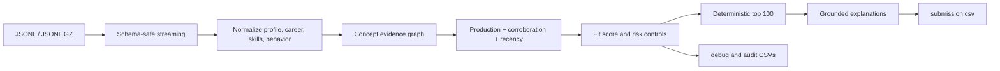

# Redrob EvidenceGraph Ranker

An explainable, CPU-only candidate-ranking engine for the Redrob Intelligent Candidate Discovery challenge. It is calibrated for the provided Senior AI Engineer founding-team role and produces the required top-100 CSV without network calls, hosted models, GPUs, or precomputed embeddings.

## Why this approach

Keyword matching is easy to game. This ranker treats each profile as an evidence graph:

- **Career evidence** proves that a candidate has worked on retrieval, ranking, recommendations, matching, and evaluation.
- **Production evidence** distinguishes shipped or owned systems from demos, tutorials, and tool lists.
- **Corroboration** rewards skills only when duration, assessments, endorsements, and career history support them.
- **Recency** weights current work above old exposure.
- **Hireability** uses activity, response, notice-period, and logistics signals, but cannot overpower weak job fit.
- **Risk controls** reject negated claims, keyword stuffing, suspicious zero-duration expertise, non-target ML pivots, stale profiles, and weak logistics.

The result is deterministic and auditable: every score component and explanation comes from candidate fields.

## Quick start

```powershell
python -m venv .venv
.\.venv\Scripts\python.exe -m pip install -r requirements.txt
.\.venv\Scripts\python.exe rank.py `
  --candidates "path\to\candidates.jsonl" `
  --out submission.csv `
  --debug-out scored_candidates.csv `
  --audit-out top100_audit.csv
```

For MSYS Python on Windows, the executable may be under `.venv\bin\python.exe`.

Validate with the challenge bundle:

```powershell
python validate.py submission.csv
python "path\to\validate_submission.py" submission.csv
```

## Output

`submission.csv` contains exactly:

```text
candidate_id,rank,score,reasoning
```

Ranks are deterministic: score descending, then `candidate_id` ascending. Reasoning is template-generated from source facts and does not invent employers, skills, or outcomes.

Optional review artifacts:

- `scored_candidates.csv`: all candidates with component scores, evidence concepts, and risk flags.
- `top100_audit.csv`: recruiter-oriented A/B/C review of the emitted shortlist.

## Architecture



Key modules:

- `src/redrob_ranker/features.py`: normalization, concept evidence, recency, production, skills, behavior, logistics, and risk.
- `src/redrob_ranker/config.py`: transparent scoring calibration.
- `src/redrob_ranker/scoring.py`: component scoring and deterministic ranking.
- `src/redrob_ranker/reasoning.py`: factual recruiter-facing explanations.
- `src/redrob_ranker/io.py`: JSONL/GZIP input and submission/debug/audit writers.
- `src/redrob_ranker/validation.py`: local output-contract validation.
- `rank.py`: command-line entrypoint.

See [`docs/scoring_methodology.md`](docs/scoring_methodology.md) for the full decision model.
See [`docs/synthetic_evaluation.md`](docs/synthetic_evaluation.md) for labeled end-to-end ranking results.

## Verification

```powershell
.\.venv\Scripts\python.exe -m pytest --rootdir . -q
```

Verified in this repository:

- 43 tests passing, including an end-to-end synthetic ranking regression.
- Labeled 300-candidate evaluation: Precision@75 1.000, Recall@75 1.000, NDCG@75 0.979.
- Larger 1,200-candidate stress run: Precision@300 1.000, Recall@300 1.000, NDCG@300 0.983.
- Adversarial coverage for negated claims, keyword stuffing, aliases, missing telemetry, stale profiles, logistics, non-target domains, and deterministic ties.
- End-to-end CLI contract check: 120 JSONL candidates produced 100 ranked rows plus debug and audit files.
- Synthetic 10,000-candidate benchmark: 10.55 seconds on the current development machine, about 948 candidates/second.

The challenge dataset is intentionally excluded from Git. Run the command above against the private bundle to generate the final `submission.csv` and execute the official validator before upload.

## Design constraints

- Python standard library only on the ranking path.
- No ranking-time internet access.
- No GPU requirement.
- Bounded feature scores prevent repeated keywords from dominating.
- Missing behavioral fields are treated as unknown, not automatically negative.
- Duplicate or missing candidate IDs and malformed JSON produce actionable errors.
