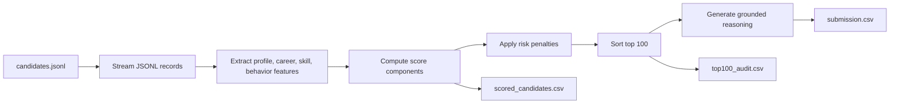
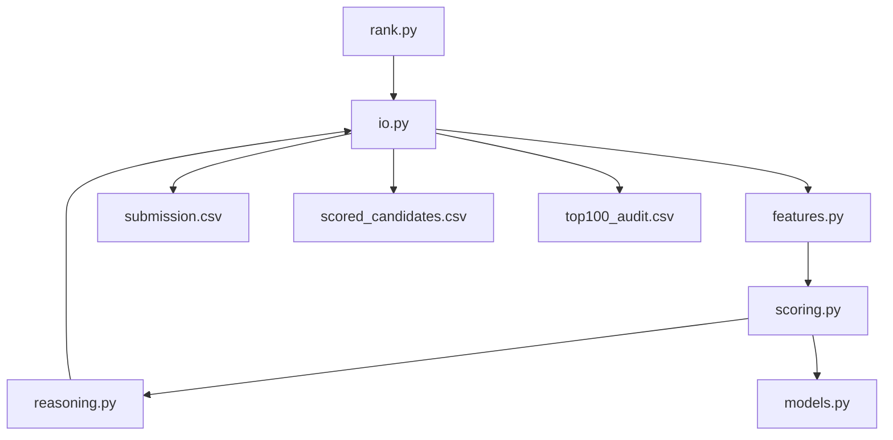

# Redrob Track 1 Submission

## Team Name

AllKnighters

## Problem Statement

Recruiters need to identify a small number of genuinely strong Senior AI Engineer candidates from a large profile pool. Keyword filters over-rank candidates who list AI tools without shipped systems experience, and they under-rank candidates whose career histories describe relevant search, retrieval, ranking, and matching work in plain language.

## Solution Overview

This solution is a deterministic candidate ranker that optimizes for recruiter-trustable evidence, not keyword density. It streams the candidate JSONL file, extracts job-specific evidence, scores each candidate across fit and hireability dimensions, applies risk penalties, and emits a valid top-100 CSV with grounded explanations.

## JD Understanding

The JD is for a Senior AI Engineer on a founding AI team. The strongest candidates have 5-9 years of hands-on applied ML experience, production search/retrieval/ranking/recommendation work, strong Python, evaluation literacy, product-company exposure, and a willingness to ship systems rather than stay in research-only mode.

Important negative signals include pure research profiles, demo-only LLM/RAG experience, consulting-only trajectories, non-target ML domains without NLP/search depth, title chasing, weak availability, stale activity, poor response rate, and difficult logistics.

## Candidate Evaluation

The ranker evaluates:

- Current title and seniority fit.
- Career-history evidence for retrieval, ranking, search, recommendation systems, matching layers, candidate generation, reranking, two-tower models, cross encoders, and evaluation.
- Lower-weight profile/headline evidence for candidates who summarize relevant work outside career descriptions.
- Skill trust based on relevant skill names, duration, proficiency, endorsements, assessment scores, and whether career history supports the skill.
- Product-company and AI/ML industry experience.
- Redrob behavioral signals: open-to-work, last active date, recruiter response rate, response time, notice period, interview completion, offer acceptance, recruiter saves, and verification.
- Risk flags for keyword stuffing, generic AI demos, non-target ML domains, outside-India logistics, stale profiles, low response rate, and suspicious skill claims.

## Ranking Methodology

Each candidate receives component scores for role, seniority, retrieval evidence, ranking evidence, evaluation evidence, profile evidence, skills, product-company history, availability, logistics, and risk. Final ranking sorts by total score descending and uses `candidate_id` ascending as the deterministic tie-breaker.

The strongest top-10 candidates are expected to have production search/retrieval/ranking evidence, India/logistics fit, recent activity, open-to-work or strong availability signals, and no major risk flags.

## Explainability

The `reasoning` column is generated from candidate fields only. It mentions specific facts such as title, years of experience, evidence phrases, location, recruiter response rate, notice period, and concerns. No hosted LLM or free-form hallucination-prone generator is used.

## Data Validation

Validation steps used:

- Unit tests for features, scoring, reasoning, debug output, audit output, and CSV shape.
- Full 100K-candidate ranking run.
- Optional `scored_candidates.csv` for component-score debugging.
- Optional `top100_audit.csv` for A/B/C top-100 review.
- Official `validate_submission.py` format validation.

## End-to-End Workflow

## System Architecture

## Results & Performance

- Tests: 29 passing.
- Full run with submission, debug, and audit outputs: 111.27 seconds locally, under the 5-minute CPU budget.
- Official validator result: `Submission is valid.`
- Top-100 output: exactly 100 rows with factual reasoning.

## Technologies Used

- Python standard library for the ranker.
- `pytest` for tests.
- GitHub Actions CI for repeatable test checks.
- Mermaid for workflow and architecture diagrams.

## GitHub Link

https://github.com/priyanshuchawda/redrob-ranker

## Final Submission Fields Still Needed

The following values must be filled with real private/team data before portal upload:

- Primary contact name, email, and phone.
- Full team member list.
- Sandbox or demo link.
