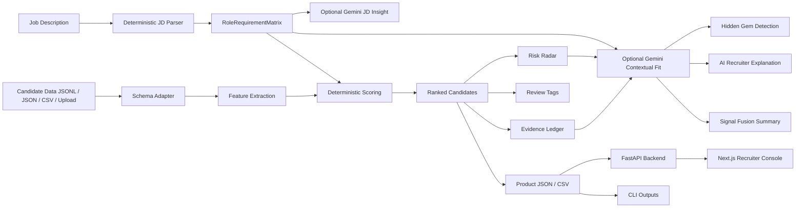
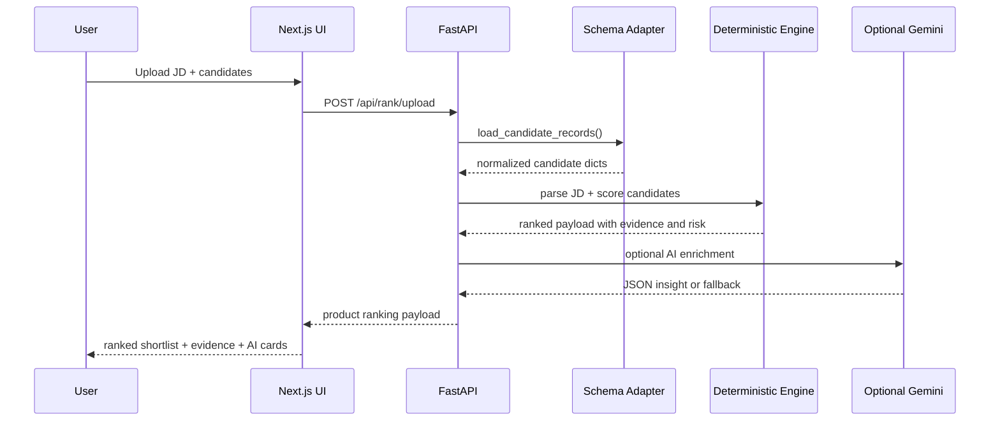

# EvidenceGraph Ranker — Updated Deep Architecture Report

## 1. Executive summary

EvidenceGraph Ranker is now a hybrid AI recruiting intelligence system for the Redrob candidate ranking challenge. The project keeps deterministic scoring as the primary ranking backbone, then adds an optional Gemini assisted insight layer for deeper JD understanding, contextual relevance, hidden-gem detection, recruiter explanations, semantic comparison, and signal-fusion summaries.

The key architectural decision is separation of authority:

- Deterministic engine decides rank order and final scores.
- Evidence Ledger and Risk Radar ground the decision in supplied candidate data.
- Gemini assisted insight is optional, metadata-labeled, and never silently changes the final rank.
- If Gemini is disabled, unavailable, missing an API key, or returns invalid JSON, the system returns deterministic fallback AI fields.

This makes the product both demo-friendly and audit-friendly: recruiters get modern AI insight, while judges can still inspect exactly how the shortlist was produced.

## 2. Product positioning

> Gemini Flash Lite provides AI assisted JD understanding and contextual relevance. EvidenceGraph keeps ranking grounded through deterministic scoring, evidence ledgers and risk validation.

Shorter pitch:

> EvidenceGraph Ranker ranks candidates by proof, context, hireability and risk — not keyword overlap.

## 3. Problem statement alignment

The challenge asks for an AI brain for modern hiring that can:

- understand complex job descriptions;
- go beyond keyword filtering;
- evaluate contextual relevance;
- integrate profile attributes, career metadata and behavioral/activity signals;
- produce a fast, accurate shortlist.

EvidenceGraph addresses this through a layered system:

| Challenge requirement | EvidenceGraph implementation |
|---|---|
| Deep job understanding | Deterministic `RoleRequirementMatrix` plus optional Gemini assisted JD insight |
| Contextual relevance | deterministic feature extraction plus optional `ai_contextual_fit` |
| Profile/career/behavioral signals | `features.py` reads profile, career history, skills and `redrob_signals` |
| Shortlist output | legacy CSV and rich product JSON/CSV exports |
| Explainability | Evidence Ledger, Risk Radar, review tags, recruiter reasoning, AI recruiter explanation |
| Fast ranking | CPU-only deterministic scoring remains primary |
| Auditability | Gemini cannot overwrite final deterministic score |

## 4. High-level architecture



## 5. Core principle: deterministic first, Gemini assisted second

The system does not turn Gemini into a hidden decision maker. Instead:

1. The deterministic engine parses, extracts, scores and ranks.
2. The product output is built with scores, evidence, risks and review tags.
3. Fallback AI fields are added even when Gemini is unavailable.
4. If Gemini is enabled, Gemini replaces only the assistive insight fields.
5. Final rank and `final_score` remain deterministic.

This matters because hiring systems must be explainable, repeatable and defensible.

## 6. Repository structure

```text
updated_redrob_ranker/
  rank.py
  validate.py
  battlecards.py
  compare.py
  evaluate.py
  requirements.txt
  .env.example
  api/
    main.py
    schemas.py
    routes/
      ai.py
      candidates.py
      compare.py
      evaluation.py
      exports.py
      ranking.py
      trust_audit.py
    services/
      gemini_service.py
      ranker_service.py
  src/redrob_ranker/
    ai_fusion.py
    battlecards.py
    comparison.py
    config.py
    evaluation.py
    evidence_ledger.py
    fairness.py
    features.py
    io.py
    job_understanding.py
    models.py
    reasoning.py
    review_tags.py
    risk.py
    schema.py
    scoring.py
    trust_audit.py
    validation.py
  frontend/
    app/
    components/
    hooks/
    lib/
  tests/
  docs/
  outputs/
```

## 7. Ranking engine architecture

The ranking engine lives under `src/redrob_ranker`. This package is the core product brain and can be used by CLI, API and tests.

### 7.1 Models

File: `src/redrob_ranker/models.py`

Main data objects:

- `CandidateFeatures`
- `ScoreComponents`
- `ProductScores`
- `ScoredCandidate`
- `RankedCandidate`

These objects separate raw candidate extraction, internal scoring and product-facing normalized scores.

### 7.2 Configuration

File: `src/redrob_ranker/config.py`

Contains scoring weights through `ScoringWeights` and `DEFAULT_WEIGHTS`.

The current architecture is intentionally transparent: no trained black-box model is needed to understand why a candidate scored high or low.

### 7.3 Schema adapter

File: `src/redrob_ranker/schema.py`

Purpose:

- load multiple candidate file formats;
- normalize records into the scoring shape;
- preserve raw records for traceability;
- report data-quality assumptions.

Supported formats:

- JSONL
- JSONL.GZ
- JSON
- CSV
- nested candidate payloads
- API multipart uploads

Important behavior:

- duplicate candidate IDs are rejected;
- malformed JSONL rows get line-specific errors;
- CSV fields are mapped best-effort into profile/skills/career structures.

### 7.4 JD understanding

File: `src/redrob_ranker/job_understanding.py`

Creates `RoleRequirementMatrix`, including:

- role title;
- must-have skills;
- strong signal skills;
- good-to-have skills;
- seniority expectations;
- domain expectations;
- production expectations;
- leadership expectations;
- location requirements;
- availability requirements;
- risk blockers.

This is deterministic and heuristic. It is not the Gemini layer. Gemini now sits separately as optional assisted insight.

### 7.5 Feature extraction

File: `src/redrob_ranker/features.py`

Extracts signals from:

- profile headline and summary;
- current title/company/industry;
- career history;
- projects;
- skills;
- behavioral/activity metadata in `redrob_signals`;
- location and availability data.

Feature categories include:

- role fit;
- seniority;
- retrieval/search evidence;
- ranking evidence;
- evaluation evidence;
- production proof;
- engineering depth;
- leadership;
- skill trust;
- availability;
- logistics;
- risk flags.

### 7.6 Scoring

File: `src/redrob_ranker/scoring.py`

The scoring pipeline:

1. strip protected/irrelevant attributes;
2. extract candidate features;
3. compute component scores;
4. apply JD-aware adjustments;
5. normalize into product scores;
6. rank candidates.

Internal component formula conceptually combines:

```text
role
+ seniority
+ retrieval
+ ranking
+ evaluation
+ profile_evidence
+ skills
+ product
+ production
+ engineering
+ leadership
+ confidence
+ availability
+ logistics
- risk
```

Product-facing scores:

- `final_score`
- `fit_score`
- `proof_score`
- `confidence_score`
- `hireability_score`
- `risk_score`

Tie-breaking:

```text
score descending, then candidate_id ascending
```

### 7.7 Evidence Ledger

File: `src/redrob_ranker/evidence_ledger.py`

This is one of the strongest parts of the system. It creates:

- positive evidence;
- negative evidence;
- missing evidence;
- source fields;
- snippets;
- confidence;
- score impact;
- claim/proof labels;
- interview focus.

Evidence types distinguish:

- profile/skill claim;
- career proof;
- strong production proof;
- missing proof;
- risk evidence.

This helps recruiters understand not only who ranked high, but why.

### 7.8 Risk Radar

File: `src/redrob_ranker/risk.py`

Risk Radar turns risk flags into structured objects:

- `risk_type`
- `severity`
- `evidence`
- `score_impact`
- `explanation`

Risks can include:

- weak proof behind strong claims;
- missing important evidence;
- location mismatch;
- availability issues;
- generic AI demo-heavy profile;
- non-target domain;
- stale profile;
- low response rate.

### 7.9 Review tags

File: `src/redrob_ranker/review_tags.py`

Review tags are compact recruiter-facing labels such as:

- no major blocker;
- weak career-backed ranking evidence;
- location risk;
- strong claims but weak proof;
- missing production proof.

They are useful in the table view because recruiters do not have to open every candidate to understand the review angle.

### 7.10 Fairness guard

File: `src/redrob_ranker/fairness.py`

The fairness layer strips configured protected/irrelevant attributes before scoring. This is not a full bias audit, but it prevents obvious protected attributes from becoming scoring evidence.

The project should not claim to be bias-free. Correct wording:

> EvidenceGraph uses role-relevant evidence and strips configured protected attributes, but full fairness validation requires labeled demographic and outcome analysis.

## 8. Gemini assisted layer

### 8.1 Environment

Local `.env`:

```text
GEMINI_API_KEY=<local-secret>
GEMINI_MODEL=gemini-3.1-flash-lite
GEMINI_ENABLED=true
```

Committed `.env.example`:

```text
GEMINI_API_KEY=replace-with-your-gemini-api-key
GEMINI_MODEL=gemini-3.1-flash-lite
GEMINI_ENABLED=false
```

`.env` is ignored by Git and must not be committed.

### 8.2 Gemini service

File: `api/services/gemini_service.py`

Responsibilities:

- load local `.env`;
- read secrets only from environment variables;
- detect whether Gemini is enabled;
- call official `google-genai` SDK only when enabled;
- request structured JSON output;
- parse and normalize Gemini JSON;
- clamp contextual fit score;
- fail safely to fallback JSON;
- include metadata in every response.

Every AI response includes:

```json
{
  "gemini_enabled": false,
  "model_used": "gemini-3.1-flash-lite",
  "fallback_used": true,
  "generated_at": "..."
}
```

### 8.3 AI fallback and signal fusion

File: `src/redrob_ranker/ai_fusion.py`

This module exists so CLI/product outputs also receive safe AI-shaped fields without requiring Gemini.

Functions include:

- `fallback_ai_jd_insight`
- `fallback_contextual_fit`
- `fallback_recruiter_explanation`
- `build_signal_fusion_summary`
- `detect_hidden_gem`
- `enrich_payload_with_fallback_ai`
- `clamp_score`

This design means product JSON always has a stable schema, even when Gemini is off.

### 8.4 AI JD Insight

Function:

```python
generate_ai_jd_insight(job_text, deterministic_matrix)
```

Returns:

```json
{
  "role_archetype": "",
  "must_have_skills": [],
  "semantic_skill_synonyms": [],
  "strong_success_signals": [],
  "seniority_expectations": [],
  "domain_expectations": [],
  "negative_signals": [],
  "hiring_constraints": [],
  "interview_focus_areas": [],
  "confidence": 0.0,
  "missing_information": []
}
```

Purpose:

- understand nuanced JD context beyond exact keywords;
- suggest synonyms and success signals;
- preserve deterministic matrix as grounding.

### 8.5 AI Contextual Fit

Function:

```python
generate_contextual_fit(candidate_payload, job_matrix, evidence_ledger, risk_radar)
```

Returns:

```json
{
  "contextual_fit_score": 0,
  "semantic_fit_reason": "",
  "hidden_strengths": [],
  "weak_context_signals": [],
  "evidence_supported": [],
  "evidence_missing": [],
  "risk_notes": [],
  "recommended_interview_checks": []
}
```

Important rule:

`contextual_fit_score` is an assistive field. It does not overwrite `final_score`.

### 8.6 Hidden Gem Detection

Implemented in:

```text
src/redrob_ranker/ai_fusion.py
```

A candidate can become a hidden gem only if:

- they are not the top exact/fit match;
- proof score is strong;
- contextual fit score is strong;
- risk score is low;
- Evidence Ledger contains proof or strong proof.

Output fields:

- `hidden_gem_candidate`
- `hidden_gem_reason`
- `hidden_gem_evidence`

This is deliberately strict. A keyword-stuffed or high-risk candidate should not be promoted as a hidden gem.

### 8.7 AI Recruiter Explanation

Function:

```python
generate_recruiter_explanation(candidate_payload, score_breakdown, evidence_ledger, risk_radar, ai_contextual_fit)
```

Returns:

```json
{
  "executive_summary": "",
  "why_shortlisted": [],
  "strongest_evidence": [],
  "hidden_strengths": [],
  "concerns": [],
  "missing_proof": [],
  "interview_questions": [],
  "final_recruiter_note": ""
}
```

Prompt guardrails include:

- use only supplied data;
- do not invent achievements;
- do not infer protected attributes;
- do not use gender, age, caste, religion, race, disability or other protected traits;
- if evidence is missing, write `Missing from supplied data`;
- return valid JSON only.

### 8.8 Signal Fusion Summary

Each candidate gets:

```json
{
  "role_fit": "strong",
  "proof_strength": "strong",
  "contextual_relevance": "moderate",
  "activity_or_behavioral_signal": "strong",
  "hireability": "strong",
  "risk": "low",
  "summary": "..."
}
```

This summarizes the six major decision dimensions:

1. role fit;
2. proof strength;
3. contextual relevance;
4. activity or behavioral signal;
5. hireability;
6. risk.

## 9. Product output architecture

Product output is built in:

```text
src/redrob_ranker/io.py
```

`build_product_ranking_output()` creates:

- metadata;
- role requirements;
- rankings;
- data quality report;
- evidence ledgers;
- risk radar;
- review tags;
- deterministic reasons;
- AI fallback fields.

Then the API layer optionally enriches these AI fields with Gemini.

### 9.1 Legacy CSV remains unchanged

The old challenge format still exists:

```text
candidate_id,rank,score,reasoning
```

Command:

```powershell
python rank.py --candidates data/candidates.jsonl --out outputs/submission.csv --top-n 3
```

Validator:

```powershell
python validate.py outputs/submission.csv --expected-rows 3
```

This is important because the challenge submission format remains compatible.

### 9.2 Rich product JSON

Command:

```powershell
python rank.py --job data/job.txt --candidates data/candidates.jsonl --output outputs/ranked_candidates.json --csv-out outputs/ranked_candidates.csv --top-n 50 --audit
```

Each ranking row includes:

- deterministic rank;
- final score;
- fit/proof/confidence/hireability/risk scores;
- main reason;
- structured reasons;
- risks;
- review tag;
- review tags;
- missing evidence;
- interview focus;
- evidence ledger;
- scoring components;
- `ai_contextual_fit`;
- `ai_recruiter_explanation`;
- `hidden_gem_candidate`;
- `hidden_gem_reason`;
- `hidden_gem_evidence`;
- `signal_fusion_summary`.

Payload-level field:

- `ai_jd_insight`.

## 10. FastAPI backend architecture

Entry:

```text
api/main.py
```

The FastAPI app includes routers:

- ranking;
- candidates;
- compare;
- evaluation;
- exports;
- trust audit;
- AI.

### 10.1 Core service

File:

```text
api/services/ranker_service.py
```

Responsibilities:

- load demo data;
- rank JSON candidates;
- rank uploaded candidates;
- store latest payload in memory;
- list latest candidates;
- return candidate detail;
- compare candidates;
- evaluate rankings;
- export latest CSV;
- build Trust Audit;
- enrich payloads with Gemini assisted fields when enabled.

### 10.2 Gemini service

File:

```text
api/services/gemini_service.py
```

Responsibilities:

- Gemini config;
- safe JSON generation;
- fallback behavior;
- prompt guardrails;
- AI endpoint implementation logic.

### 10.3 API endpoints

Existing endpoints:

| Method | Path | Purpose |
|---|---|---|
| GET | `/api/health` | health check |
| GET | `/api/demo-data` | demo JD/candidates |
| POST | `/api/rank` | rank JSON payload |
| GET | `/api/rank/latest` | latest in-memory ranking |
| POST | `/api/rank/upload` | multipart candidate/job upload |
| GET | `/api/candidates` | latest candidate list |
| GET | `/api/candidates/{candidate_id}` | candidate detail |
| POST | `/api/compare` | deterministic comparison plus optional AI semantic comparison |
| POST | `/api/evaluate` | labeled/proxy evaluation |
| GET | `/api/exports/ranked-json` | latest JSON export |
| GET | `/api/exports/ranked-csv` | latest CSV export |
| GET | `/api/trust-audit` | latest proof/risk audit plus optional AI summary |

New AI endpoints:

| Method | Path | Purpose |
|---|---|---|
| POST | `/api/ai/jd-insight` | Gemini assisted or fallback JD insight |
| POST | `/api/ai/contextual-fit` | Gemini assisted or fallback contextual fit |
| POST | `/api/ai/recruiter-explanation` | Gemini assisted or fallback recruiter explanation |
| POST | `/api/ai/hidden-gems` | list hidden gems from latest payload |
| POST | `/api/ai/signal-fusion-summary` | signal summaries from latest payload |

## 11. Frontend architecture

Framework:

- Next.js 14
- React 18
- TypeScript
- Tailwind CSS
- lucide-react

### 11.1 Frontend routes

| Route | Purpose |
|---|---|
| `/` | landing |
| `/dashboard` | overall ranking view |
| `/run-ranking` | upload/paste/demo ranking flow |
| `/candidates` | ranked candidate table |
| `/candidates/[id]` | candidate detail |
| `/compare` | candidate A/B comparison |
| `/evaluation` | proxy/labeled evaluation framing |
| `/exports` | output/export links |
| `/trust-audit` | proof/risk/missing evidence audit |

### 11.2 Important components

Existing:

- `AppShell`
- `CandidateTable`
- `EvidenceLedgerPanel`
- `EvidenceLedgerPreview`
- `MetricCard`
- `RiskRadar`
- `RoleRequirementMatrix`
- `ScoreBreakdown`
- `TrustAuditSummary`

New:

- `AIInsightCards.tsx`

This includes:

- `AIJDInsightCard`
- `AIContextualFitCard`
- `AIRecruiterExplanationCard`
- `SignalFusionCard`

### 11.3 AI UI behavior

AI cards render only when:

```text
gemini_enabled === true
```

This prevents the UI from pretending AI is active when Gemini is disabled or unavailable.

Required wording is respected:

- Uses “Gemini assisted insight”.
- Does not say Gemini generated final ranking.
- Does not say AI guarantees the best candidate.

### 11.4 Dashboard

Shows:

- total candidates;
- shortlisted candidates;
- average confidence;
- high-risk count;
- runtime;
- optional AI JD Insight card;
- optional Signal Fusion overview;
- JD requirement matrix;
- candidate table;
- score breakdown;
- evidence ledger preview;
- risk radar.

### 11.5 Candidate detail

Shows:

- rank and candidate ID;
- deterministic score breakdown;
- recruiter reasoning;
- optional AI Contextual Fit card;
- optional Hidden Gem badge;
- optional Signal Fusion card;
- optional AI Recruiter Explanation;
- JD matrix;
- Evidence Ledger;
- Risk Radar;
- review tags;
- missing evidence.

### 11.6 Compare page

Shows:

- candidate A/B score panels;
- deterministic decision view;
- score deltas;
- where candidate B is stronger;
- recruiter verification checks;
- optional AI semantic comparison;
- evidence differences;
- risk comparison.

### 11.7 Trust Audit page

Shows:

- proof and confidence health;
- high-risk counts;
- missing evidence categories;
- proof-vs-claim summary;
- optional AI verification priorities.

## 12. CLI tools

### 12.1 `rank.py`

Main ranking CLI.

Supports:

- old challenge CSV output;
- product JSON output;
- product CSV output;
- audit output;
- JD-aware ranking.

### 12.2 `validate.py`

Validates legacy CSV structure.

### 12.3 `battlecards.py`

Creates recruiter-ready Markdown battle cards.

### 12.4 `compare.py`

Compares two candidates by deterministic score/evidence/risk logic.

### 12.5 `evaluate.py`

Runs labeled or proxy evaluation.

Important: evaluation without labels is proxy only.

### 12.6 `scripts/benchmark_runtime.py`

Duplicates candidate records to benchmark runtime at different candidate counts.

## 13. Data flow: end-to-end ranking



## 14. Testing architecture

The current verified Python suite passed:

```text
90 passed in 3.27s
```

Test areas include:

- API health and upload;
- backend latest ranking;
- candidate comparison reuse;
- feature extraction;
- scoring and ranking;
- evidence ledger;
- schema ingestion;
- product JSON output;
- Trust Audit;
- frontend source readiness;
- synthetic evaluation;
- Gemini disabled fallback;
- invalid Gemini JSON fallback;
- contextual score clamping;
- final score protection;
- hidden gem proof/risk requirements;
- protected attribute guardrails;
- AI endpoint metadata.

The frontend production build passed after the Gemini UI additions.

## 15. Safety and privacy architecture

### 15.1 Secret handling

- Real `.env` is ignored.
- `.env.example` is safe to commit.
- API key is read only from environment variables/local `.env`.
- No secret is hardcoded in source code.

### 15.2 Gemini failure behavior

Gemini can fail because:

- disabled;
- missing API key;
- SDK unavailable;
- network failure;
- invalid JSON;
- malformed response.

In all cases, the system returns fallback JSON.

### 15.3 Guardrails

Prompt guardrails prohibit:

- invented achievements;
- unsupported evidence;
- protected-attribute inference;
- gender, age, caste, religion, race, disability or other protected traits;
- non-JSON output.

### 15.4 Local data handling

Current backend state is in memory. There is no production database or long-term run store.

## 16. Performance architecture

The deterministic ranker is CPU-only and approximately linear in candidate count.

Gemini is optional and can add latency only to AI enrichment paths. Because deterministic ranking is primary, the system can still produce ranked outputs without Gemini.

Recommended production strategy:

- keep deterministic rank synchronous for fast shortlist;
- run Gemini enrichment asynchronously for large batches;
- cache AI insight per JD/candidate run;
- avoid blocking the core ranker on AI service availability.

## 17. Strengths

1. Deterministic primary ranking.
2. Optional Gemini assisted context.
3. No hidden AI decision-making.
4. Evidence Ledger with snippets and source fields.
5. Claim vs proof distinction.
6. Risk Radar and review tags.
7. Flexible candidate ingestion.
8. Legacy challenge CSV preserved.
9. Rich product JSON and CSV outputs.
10. FastAPI backend.
11. Next.js recruiter console.
12. Mocked tests for Gemini.
13. Safe fallback behavior.
14. Guardrails for protected attributes.
15. Local `.env` and safe `.env.example`.

## 18. Limitations

| Limitation | Current state | Future improvement |
|---|---|---|
| Real accuracy | No official labeled benchmark in repo | Evaluate on official labels |
| JD parsing | deterministic heuristic + optional Gemini insight | Add calibrated parser or recruiter-editable matrix |
| Gemini latency | synchronous enrichment in current API path | async jobs/caching |
| Storage | latest API payload in memory | persistent database/run history |
| Large uploads | multipart parsing works, not production streaming | object storage + background workers |
| Fairness | protected field stripping only | statistical bias audit |
| Auth | not implemented | auth, roles, tenant isolation |
| Deployment | local demo | hosted app with secrets manager |

## 19. Recommended demo flow

1. Open Dashboard.
2. Show JD matrix.
3. Explain deterministic ranking is primary.
4. Enable Gemini locally with `.env`.
5. Show “Gemini assisted insight” card.
6. Open candidate detail.
7. Show score breakdown and Evidence Ledger.
8. Show AI Contextual Fit.
9. Point out Gemini did not change final score.
10. Show Hidden Gem badge if criteria are met.
11. Open Compare page.
12. Show deterministic comparison and optional semantic comparison.
13. Open Trust Audit.
14. Show missing evidence and verification priorities.
15. End on Exports and legacy CSV compatibility.

## 20. Correct judge-facing wording

Use:

- “Gemini assisted insight”
- “deterministic ranking remains primary”
- “evidence weighted and auditable”
- “AI contextual fit is separate from final score”
- “fallback mode works without Gemini”
- “proxy evaluation unless labels are supplied”

Avoid:

- “Gemini generated the final ranking”
- “AI guarantees the best candidate”
- “bias-free hiring”
- “real recruiter accuracy proven”
- “externally verified evidence”
- “production-ready large-file pipeline”

## 21. Final architecture summary

EvidenceGraph Ranker is best understood as four layers:

1. Data layer: reads JD and candidates in multiple formats.
2. Deterministic intelligence layer: extracts features, scores, ranks, explains and validates.
3. Optional Gemini assisted layer: adds JD insight, contextual relevance, hidden-gem reasoning and recruiter explanations.
4. Product layer: exposes CLI outputs, FastAPI endpoints and a Next.js recruiter console.

The architecture is strong because it avoids the common hackathon trap of letting an LLM become an uninspectable ranker. Instead, Gemini is used where it is strongest — language/context/explanation — while the shortlist remains grounded in deterministic evidence, risk validation and auditable scoring.

