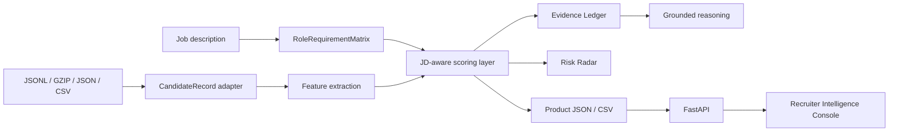

# Architecture

EvidenceGraph Ranker is organized as a deterministic Python ranking core with product surfaces around it.

## Core Flow

## Boundaries

- `src/redrob_ranker` owns business logic.
- `api/routes` only maps HTTP requests to service methods.
- `GET /api/rank/latest` exposes the current in-memory run so dashboard and comparison pages stay on the uploaded candidate set.
- `POST /api/rank/upload` adapts multipart JSONL, JSONL.GZ, JSON, and CSV files into the same deterministic ranking pipeline.
- `frontend` renders API data and falls back to bundled demo output when the backend is unavailable.
- `rank.py`, `battlecards.py`, `compare.py`, and `evaluate.py` expose judge-friendly CLI workflows.

## Determinism

No paid APIs or hosted models are required. Ranking uses deterministic feature extraction, scoring weights, role-matrix heuristics, and score sorting with candidate ID tie-breaks.

## Compatibility

The legacy challenge CSV path is still available through `--out`. Product JSON and CSV outputs are added through `--output` and `--csv-out`.
