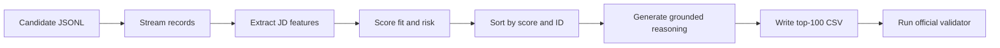
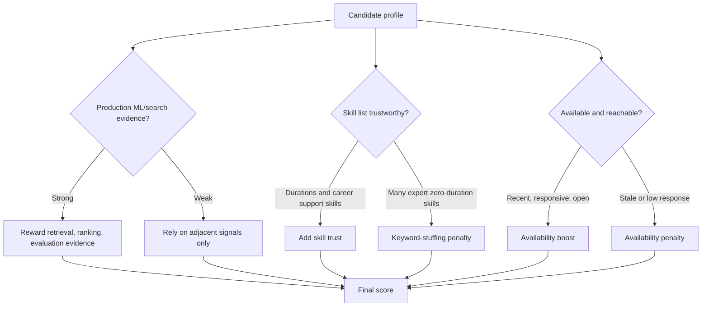
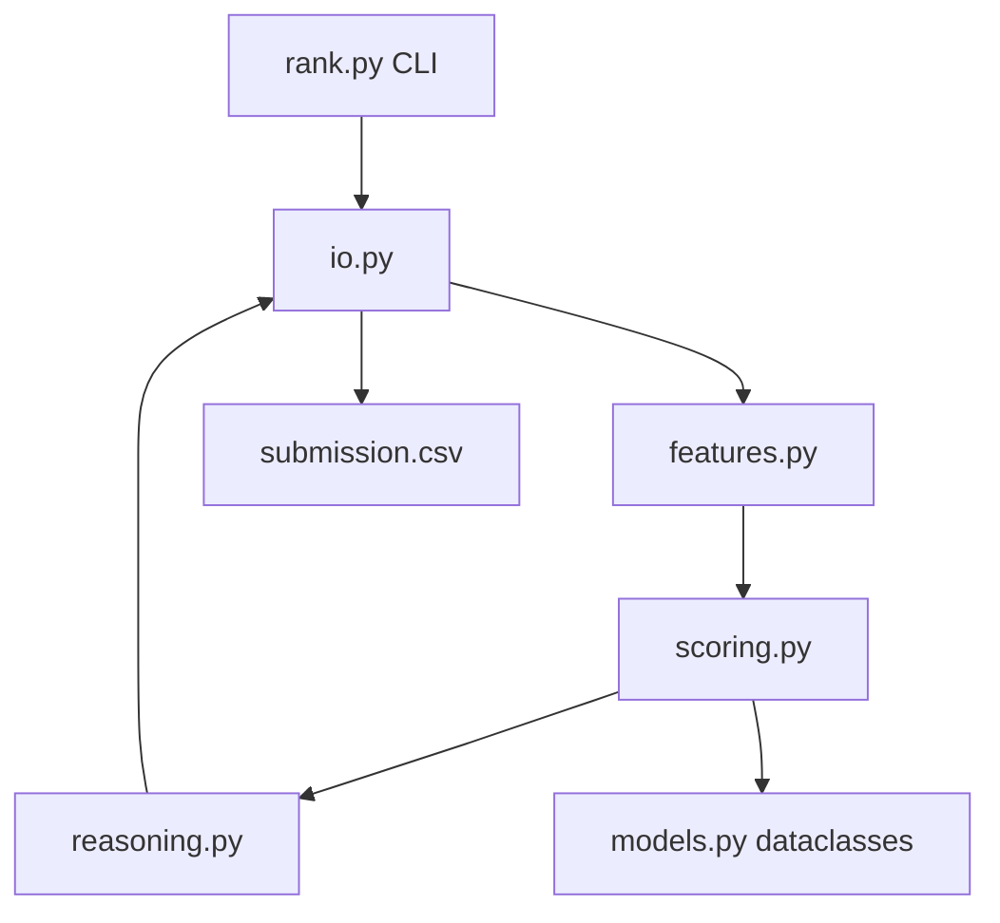
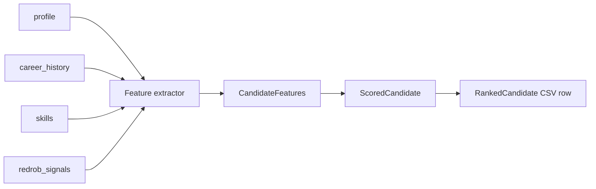

# Submission Blueprint

## Team Name

TBD

## Problem Statement

Recruiters need a reliable way to discover the few candidates in a large talent pool who truly fit a nuanced Senior AI Engineer founding-team JD. Keyword filtering over-ranks profiles that list AI tools but lack production ML/search experience, and under-ranks candidates whose career history shows relevant systems work in plain language.

## Solution Overview

The solution is a deterministic AI-recruiter ranker that reads structured candidate profiles, extracts JD-specific evidence, scores multiple fit dimensions, applies availability and risk modifiers, and emits a top-100 CSV with factual explanations.

What differentiates it:

- Career-history evidence is weighted above skills-list keyword matches.
- Behavioral Redrob signals affect practical hireability.
- Keyword stuffing and honeypot-like anomalies are penalized.
- Explanations are generated from source fields only.
- Ranking runs locally on CPU with no network calls.

## JD Understanding

Key requirements extracted from the JD:

- Senior applied AI/ML engineer, ideally 5-9 years.
- Production experience with embeddings, retrieval, ranking, vector search, recommendations, and evaluation.
- Strong Python and product-engineering mindset.
- Experience shipping real systems to users, not research-only or demo-only work.
- Preference for Pune/Noida, India, or realistic relocation from Indian tier-1 cities.
- Strong availability: recent activity, open-to-work, fast recruiter response, manageable notice period.

## Candidate Signals

Most important signals:

- Current title and career-history titles.
- Career descriptions mentioning retrieval, ranking, recommendations, search, NDCG/MRR/MAP, A/B tests, and shipped ML systems.
- Relevant skill names, proficiency, duration, endorsements, and assessment scores.
- Product-company and AI/ML industry history.
- Redrob activity: last active date, open-to-work, recruiter response rate, response time, interview completion, offer acceptance, recruiter saves, notice period, and verification.
- Risk signals: expert skills with zero duration, stale profile, low response rate, long notice, outside-India logistics, service-only career path.

## Ranking Methodology

Each candidate receives component scores:

- Role and seniority fit.
- Retrieval/search/recommendation/ranking evidence.
- Evaluation and experimentation evidence.
- Relevant skill trust.
- Product-company experience.
- Logistics fit.
- Redrob availability and engagement.
- Risk penalties.

Final rank is score descending with deterministic `candidate_id` tie-breaks.

## Explainability And Data Validation

Reasoning strings mention specific candidate facts: title, years, evidence phrases, location, response rate, notice period, and concerns. The generator does not use free-form LLM text, so it cannot hallucinate unsupported facts.

Validation steps:

- Unit tests for extraction, scoring, reasoning, and CSV output.
- Full dataset run within CPU budget.
- Official `validate_submission.py` run.
- Manual inspection of top and bottom rows in the top 100.

## End-To-End Workflow

## AI Decision Flow

## System Architecture

## Data Flow

## Results And Performance

- Unit tests: 10 passing.
- Full dataset runtime: 41.7 seconds on local CPU.
- Official validation: `Submission is valid.`
- Output: exactly 100 ranked candidates with factual reasoning.

## Technologies Used

- Python standard library for ranking.
- `pytest` for tests.
- Mermaid diagrams for architecture and workflow documentation.

